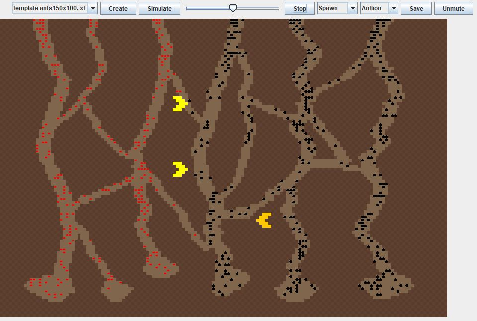

#ANT FARM SIMULATION

Java simulation used to model an ant ecosystem with animal and human interactions (mating, competition, predation, mutualism, disease, human involvement/destruction). Users can use pre-made templates or load/save their own.

